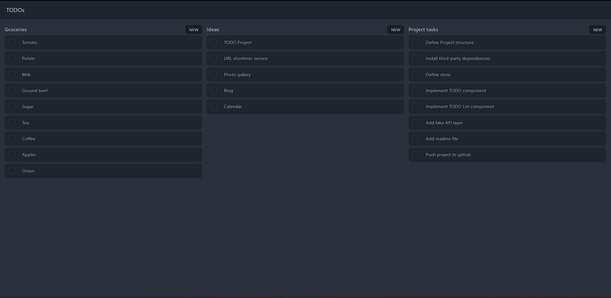

# Simple To-Do List app

## Running the application
Requires docker.
```
docker-compose up
```

## Installing new dependencies

Dependencies cannot be installed directly, it may be done via docker compose.

```
docker-compose exec web npm i ...
```

## Depndencies
- typescript
- react
- [recoil](https://recoiljs.org/) state management
- [vite](https://vitejs.dev/) bundling and tooling
- [tailwindcss](https://tailwindcss.com/) + [daisyui](https://daisyui.com/) styling and basic components

## UI

